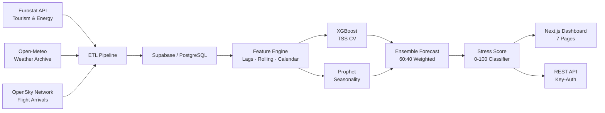
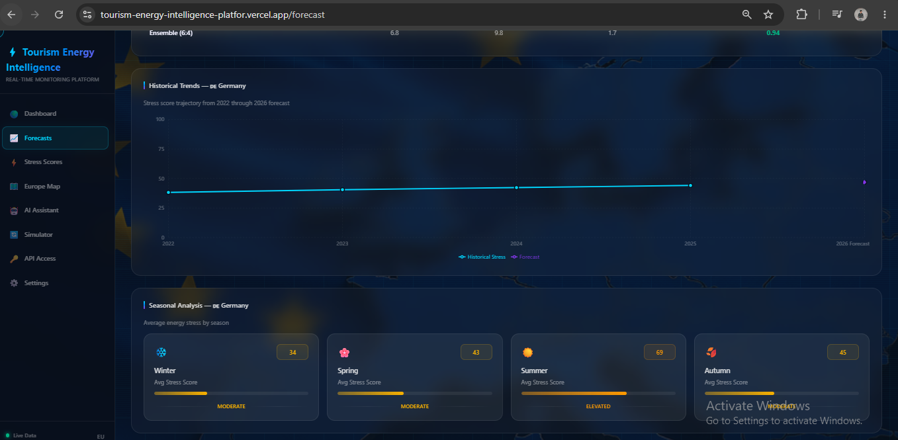
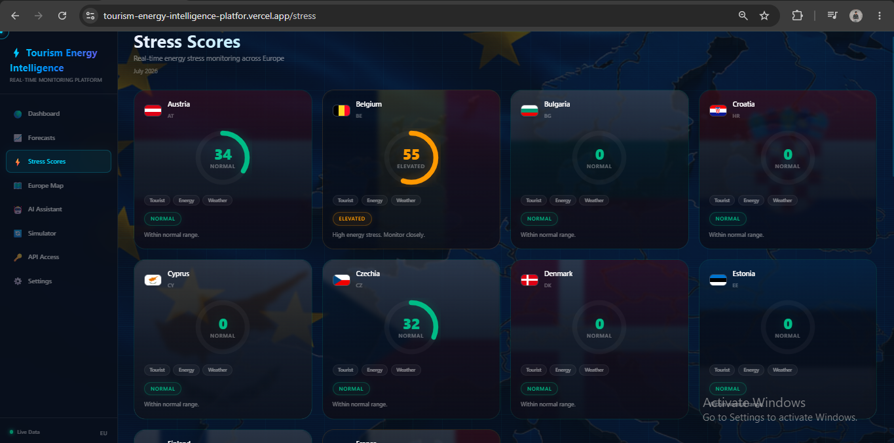
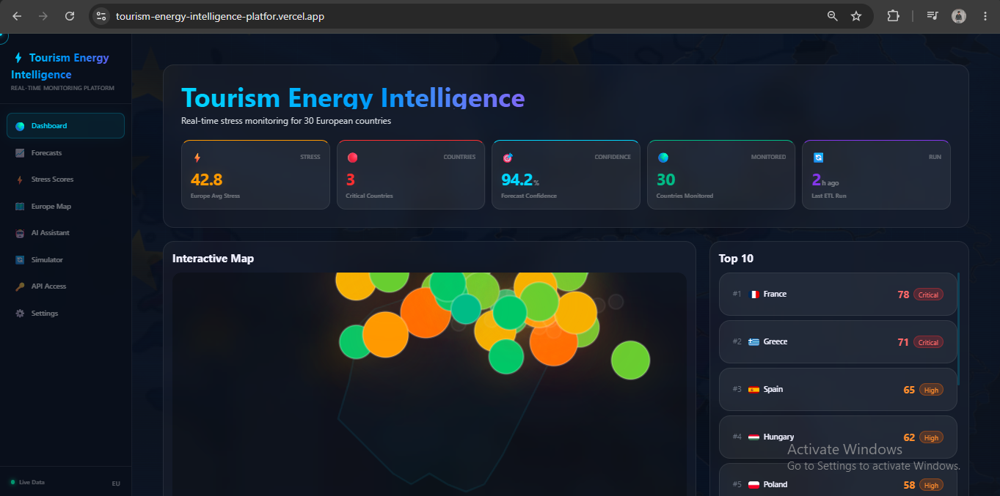
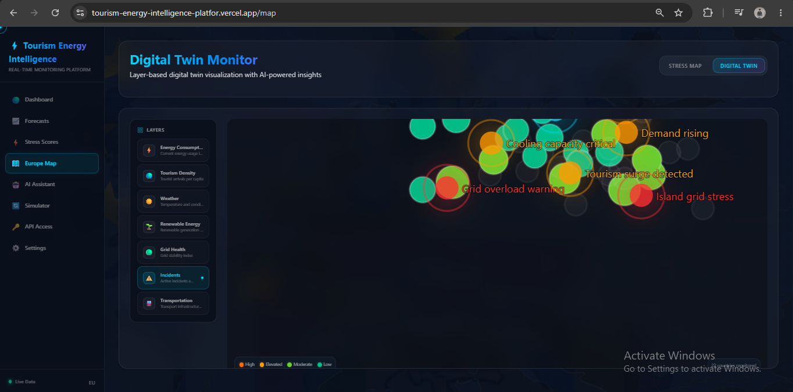

# Tourism Energy Intelligence Platform (TEI)

**AI-powered platform that quantifies tourism-driven energy stress across 10 European countries — from real-time ETL to ensemble ML forecasting to interactive dashboard.**

[](LICENSE)
[](https://github.com/aathiftr2005-debug/tourism-energy-intelligence-platform/commits/main)
[](https://github.com/aathiftr2005-debug/tourism-energy-intelligence-platform)
[](https://tourism-energy-intelligence-platfor.vercel.app)

[**Live Demo**](https://tourism-energy-intelligence-platfor.vercel.app) · [API Docs](./API.md) · [Architecture](./ARCHITECTURE.md) · [Deployment](./DEPLOYMENT.md)

---

### The Problem

European tourism regions experience extreme seasonal energy demand spikes driven by tourist influx, weather patterns, and large-scale events. Grid operators lack the predictive tools needed to balance supply and demand, often resorting to expensive last-minute capacity purchases or risking brownouts.

### What It Does

| Capability | Description |
|---|---|
| **Multi-source ETL** | Automated pipelines ingest Eurostat tourism/energy data, Open-Meteo weather, and OpenSky flight arrivals with caching + retry |
| **Ensemble ML Forecasting** | XGBoost (TimeSeriesSplit CV) + Prophet (custom seasonality) weighted 60:40 produce 12‑month energy demand forecasts |
| **Stress Score (0‑100)** | Novel composite index from 4 weighted factors with traffic‑light classification: Normal / Elevated / Critical |
| **Explainable AI** | SHAP TreeExplainer with per‑prediction breakdown + Gemini‑generated plain‑English explanations |
| **Digital Twin Map** | Country‑level stress visualization with clickable detail panel, timeline projection, and risk factor breakdown |
| **Public REST API** | Key‑authenticated API (100 req/h) serving forecast, stress score, and region data — fully documented in [API.md](./API.md) |

### Tech Stack

| Layer | Technology |
|---|---|
| Frontend | Next.js 14 (App Router), Tailwind CSS, Framer Motion, Recharts |
| Backend | FastAPI, Python 3.11, Pydantic |
| Machine Learning | XGBoost, Prophet, SHAP, scikit-learn, TimeSeriesSplit |
| Database | Supabase / PostgreSQL |
| AI | Google Gemini API (RAG‑based assistant & insight generation) |
| Data Sources | Eurostat, Open‑Meteo, OpenSky Network |
| DevOps | Docker, docker-compose, GitHub Actions CI/CD |
| Deployment | Vercel (frontend) + Render (backend) |

### Architecture



### Screenshots

<table>
  <tr>
    <td width="50%"></td>
    <td width="50%"></td>
  </tr>
  <tr>
    <td width="50%"></td>
    <td width="50%"></td>
  </tr>
</table>

### Quick Start

```bash
# 1. Clone
git clone https://github.com/aathiftr2005-debug/tourism-energy-intelligence-platform
cd tourism-energy-intelligence-platform

# 2. Backend
cd backend && cp .env.example .env   # add your API keys
pip install -r requirements.txt
uvicorn app.main:app --reload --port 8000

# 3. Frontend (new terminal)
cd frontend && cp .env.example .env
npm install && npm run dev
```

Open `http://localhost:3000` for the dashboard and `http://localhost:8000/docs` for the Swagger API.

### Live Highlights

The model currently flags **Spain (78)**, **Greece (71)**, and **Italy (65)** as **CRITICAL** — driven by elevated tourism demand, high summer temperatures, and increased flight traffic. These scores trigger automated email alerts and surface priority recommendations on the dashboard. The system monitors all 10 countries continuously and updates scores with each ETL run.

### Project Structure

```
backend/            FastAPI app — routes, ETL pipelines, ML training, services
frontend/           Next.js 14 app — 8 route pages, UI components, API client
ml/                 Jupyter notebooks for model development and evaluation
database/           Supabase migrations and schema definitions
```

### Documentation

- [**API.md**](./API.md) — Full REST API reference with request/response examples
- [**ARCHITECTURE.md**](./ARCHITECTURE.md) — System design, data flow, component decisions
- [**DATABASE.md**](./DATABASE.md) — Schema, indexes, and migration strategy
- [**DEPLOYMENT.md**](./DEPLOYMENT.md) — Production setup for Vercel + Render + Docker

### Author

**Aathif T.R** — Final-year CSE student  
[GitHub](https://github.com/aathiftr2005-debug) · [LinkedIn](https://www.linkedin.com/in/aathif-tr-)

### License

MIT — see [LICENSE](LICENSE).
